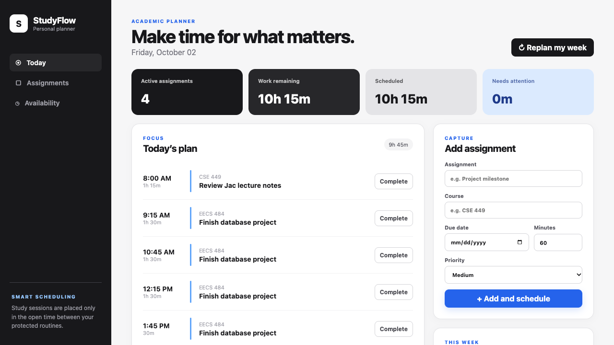

# StudyFlow

> A personal academic planner that turns assignments, deadlines, and estimated workloads into a realistic daily study plan.

**Author:** Shea Shin<br>
**UMID:** 78273912



StudyFlow is a four-component Jac application built for CSE 449 Extra Credit Assignment 1. Instead of stopping at a list of deadlines, it automatically divides unfinished work into focused study sessions, works around protected routines such as sleep and class, and replans the week when work changes.

## Why it stands out

- **Useful:** converts estimated work into concrete, time-blocked sessions.
- **Coherent:** Web, Mobile, and CLI expose workflows suited to each interface rather than duplicating one UI.
- **Deep:** deterministic scheduling considers deadlines, priority, remaining work, completed sessions, the planning window, and recurring protected time.
- **Reliable:** validates dates and estimates, preserves data in Jac's graph store, reports overloaded schedules, and includes automated scheduler tests.
- **Integrated:** every interface calls the same Jac service and reads the same persisted `Task`, `StudySession`, `ReservedBlock`, and `PlannerSettings` nodes.

## Components

```text
Web planning center ─┐
Mobile execution UI ├──> Planner service ───> Jac persistent graph
CLI quick capture ──┘      scheduling logic     Tasks + Sessions + Settings
```

- **Server:** CRUD, persistence, validation, automatic scheduling, replanning, progress calculation, and workload summaries in `core/planner_service.jac`.
- **Web:** responsive dashboard for assignment management, today’s plan, workload visualization, recurring protected time, and replanning.
- **Mobile:** focused execution interface for viewing today’s plan, completing sessions/tasks, quickly adding assignments, managing protected time, and replanning.
- **CLI:** `add`, `today`, `list`, `done`, `task-done`, `block`, `unblock`, `routine`, `settings`, `replan`, and `demo` commands.

## Prerequisites

- Jac `0.37.23` (the project pins this version in `jac.toml`)
- A modern browser
- For native mobile use: Expo-compatible Android/iOS tooling or Expo Go

Verify Jac:

```bash
jac --version
```

## Run the Web app and server

From the repository root:

```bash
jac run
```

Open the Web URL printed by Jac (with Jac 0.37.23 the default is [http://localhost:8003](http://localhost:8003)). The planner service starts alongside the Web app, prints its API URL (default `http://localhost:8002`), and persists data between runs.

For hot reload during development:

```bash
jac run --dev
```

Both commands print the active Web and API ports; use those printed values if your local ports differ.

## Use the CLI

Keep the Web/server process running. In another terminal, point the CLI bridge at the colocated planner service.

With the default API port:

```bash
export JAC_APP_PLANNER_URL=http://localhost:8002/api/planner
```

Then run:

```bash
jac run cli -- today
jac run cli -- list
jac run cli -- add "Finish CSE 449 project" --course "CSE 449" --due 2026-10-02 --minutes 240 --priority high
jac run cli -- done SESSION_ID
jac run cli -- task-done TASK_ID
jac run cli -- settings --start 8 --end 23
jac run cli -- block "Sleep" --category sleep --start 23:00 --end 08:00 --repeat daily
jac run cli -- routine
jac run cli -- replan
```

Use `jac run cli -- --help` or `jac run cli -- COMMAND --help` for complete command help.

## Run the Mobile app

First keep the Web/server process running. For the fastest mobile-interface check, run its browser target:

```bash
JAC_APP_PLANNER_URL=http://localhost:8002/api/planner \
  jac run --dev --platform web mobile
```

For a native Expo target:

```bash
jac setup mobile
JAC_APP_PLANNER_URL=http://YOUR_LAN_IP:8002/api/planner jac run --dev mobile
```

Use the computer’s LAN IP rather than `localhost` when a physical phone needs to reach the server. Follow the QR-code or simulator instructions printed by Expo.

## Scheduling behavior

When a task is added or edited, StudyFlow:

1. calculates remaining minutes after completed study sessions;
2. orders active work by deadline and then priority;
3. calculates free intervals inside the configured daily planning window;
4. subtracts recurring sleep, meal, class, exercise, commute, or custom blocks;
5. distributes work from today through each deadline in sessions of at most 90 minutes;
6. preserves completed sessions during replanning; and
7. reports any work that cannot fit before its deadline.

The algorithm is deterministic: the same task state and preferences produce the same remaining schedule.

## Demo workflow

1. Start the app with `jac run`.
2. Click **Load demo week** on the empty Web dashboard.
3. Click **Use example** under **Protected time**, then inspect how sessions move around the routine.
4. Inspect the generated sessions and seven-day workload chart.
5. Run `jac run cli -- today` with `JAC_APP_PLANNER_URL` configured and confirm the same sessions appear.
6. Complete a session from Mobile or CLI.
7. Refresh the Web dashboard and observe updated task progress.
8. Click **Replan my week** and verify that completed work stays fixed while remaining work is redistributed.

## Validation

Type-check all four apps:

```bash
jac check
```

Run the scheduler and validation tests:

```bash
jac test core/planner_service.jac -v
```

The test suite covers priority ordering, duration/time formatting, task-to-session scheduling, and invalid estimate rejection.

## Project layout

```text
core/planner_service.jac   shared data model, API, persistence, scheduler, tests
web/main.jac               browser planning center
web/styles.css             responsive visual design
mobile/main.jac            native MobUI execution interface
cli/main.jac               terminal commands
jac.toml                   four-app workspace configuration
legacy/                    unused reference routes from the original learning scaffold
```

## Notes

- The service uses public endpoints so all three interfaces intentionally share one guest planning graph for this individual-project demo.
- Dates use ISO `YYYY-MM-DD` format.
- The `legacy/` and unused `core/` reference modules remain for learning context but are excluded from StudyFlow’s checks and bundle.
